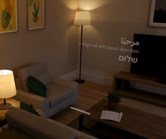

# SwiftUI-Shimmer ✨

`Shimmer` is a super-light modifier that adds a "shimmering" effect to any SwiftUI `View`, for example, to show that an operation is in progress. It works well on light and dark modes, left-to-right and right-to-left layout directions, and across all Apple platforms: iOS, macOS, tvOS, watchOS and even visionOS! 📱💻🖥️📺⌚️🥽✨

 


## Usage

```swift
import SwiftUI
import Shimmer
⋮
⋮
Text("SwiftUI Shimmer").modifier(Shimmer())
```
or more conveniently

```swift
Text("SwiftUI Shimmer").shimmering()
```


## Optional Parameters ⚙️

- `active`: Convenience parameter to conditionally enable the effect. Defaults to `true`.
- `animation`: A custom animation. Defaults to `Shimmer.defaultAnimation`.
- `gradient`: A custom gradient. Defaults to `Shimmer.defaultGradient`.
- `bandSize`: The size of the animated mask's "band". Defaults to 0.2 unit points, which corresponds to 20% of the extent of the gradient.

### Backward Compatible Parameters

- `active`: Convenience parameter to conditionally enable the effect. Defaults to `true`.
- `duration`: The duration of a shimmer cycle in seconds. Default: `1.5`.
- `bounce`: Whether to bounce (reverse) the animation back and forth. Defaults to `false`.
- `delay`: A delay in seconds. Defaults to `0`.


## Custom Animations

You can supply any custom animation:

```swift
Text("Loading...")
    .shimmering(
        active: isAnimating,
        animation: .easeInOut(duration: 2).repeatCount(5, autoreverses: false).delay(1)
    )
```

## Animated Skeletons ☠️

Of course, you can combine `.shimmering(...)` with the `.redacted(...)` modifier to create interesting animated skeleton views.


```swift
Text("Some text")
    .redacted(reason: .placeholder)
    .shimmering()
```

## Right-To-Left (RTL) Support

The mask and animation now adjusts automatically to the environment's `layoutDirection` in order to better support 
different languages and locales.  

## Installation

### Swift Package Manager
Use the package URL or search for the SwiftUI-Shimmer package: [https://github.com/markiv/SwiftUI-Shimmer](https://github.com/markiv/SwiftUI-Shimmer).

For how-to integrate package dependencies refer to [Adding Package Dependencies to Your App documentation](https://developer.apple.com/documentation/xcode/adding_package_dependencies_to_your_app).

### Cocoapods
Add this to your Podfile:

```ruby
pod 'SwiftUI-Shimmer', :git => 'https://github.com/markiv/SwiftUI-Shimmer.git'
```

## What About UIKit?

For an older, UIKit-based shimmer effect, see [UIView-Shimmer](https://github.com/markiv/UIView-Shimmer).
