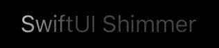

# SwiftUI-Shimmer ✨

`Shimmer` is a super-light modifier that adds a shimmering effect to any SwiftUI `View`, for example, to show that an operation is in progress. It works well on light and dark modes, and across iOS, macOS, tvOS and watchOS.

```swift
Text("SwiftUI Shimmer").modifier(Shimmer())
```
or more conveniently

```swift
Text("SwiftUI Shimmer").shimmering()
```


## Optional Parameters ⚙️
- `active`: Convenience parameter to conditionally enable the effect. Defaults to `true`.
- `duration`: The duration of a shimmer cycle in seconds. Default: `1.5`.
- `bounce`: Whether to bounce (reverse) the animation back and forth. Defaults to `false`.



## Animated Skeletons ☠️

Of course, you can combine `.shimmering(...)` with the `.redacted(...)` modifier to create interesting animated skeleton views.


```swift
Text("Some text")
	.redacted(reason: .placeholder)
	.shimmering()
```

## Installation 
SwiftUI-Shimmer can be installed using Swift Package Manager.

Use the package URL to search for the URLImage package: [https://github.com/markiv/SwiftUI-Shimmer](https://github.com/markiv/SwiftUI-Shimmer).

For how-to integrate package dependencies refer to [Adding Package Dependencies to Your App documentation](https://developer.apple.com/documentation/xcode/adding_package_dependencies_to_your_app).

## What About UIKit?
For an older, UIKit-based shimmer effect, see [UIView-Shimmer](https://github.com/markiv/UIView-Shimmer).
